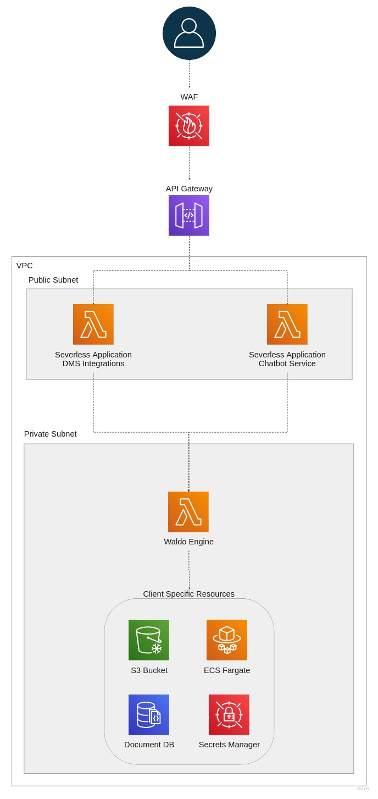

# Ask Waldo The Docs

- [Ask Waldo The Docs](#ask-waldo-the-docs)
- [1. Description of Services](#1-description-of-services)
	- [Sharepoint](#sharepoint)
		- [Description](#description)
		- [Environment](#environment)
		- [API Overview](#api-overview)
		- [Infrastructure dependencies](#infrastructure-dependencies)
		- [Library dependencies](#library-dependencies)
		- [Tests](#tests)
		- [Run test suite locally](#run-test-suite-locally)
		- [Test SAM locally](#test-sam-locally)
	- [Confluence](#confluence)
		- [Description](#description-1)
		- [API Overview](#api-overview-1)
		- [Infrastructure dependencies](#infrastructure-dependencies-1)
		- [Library dependencies](#library-dependencies-1)
		- [Tests](#tests-1)
		- [Run test suite locally](#run-test-suite-locally-1)
		- [Test coverage](#test-coverage)
	- [Information Extractor](#information-extractor)
		- [Description](#description-2)
		- [SQS Event Payload](#sqs-event-payload)
		- [Infrastructure dependencies](#infrastructure-dependencies-2)
		- [Library dependencies](#library-dependencies-2)
		- [Tests](#tests-2)
		- [Run test suite locally](#run-test-suite-locally-2)
		- [Test SAM locally](#test-sam-locally-1)
	- [Profiling](#profiling)
		- [Description](#description-3)
		- [API Overview](#api-overview-2)
		- [Infrastructure dependencies](#infrastructure-dependencies-3)
		- [Library dependencies](#library-dependencies-3)
		- [Tests](#tests-3)
		- [Run test suite locally](#run-test-suite-locally-3)
		- [Test SAM locally](#test-sam-locally-2)
	- [Keyphrase Exctractor](#keyphrase-exctractor)
		- [Description](#description-4)
		- [API Overview](#api-overview-3)
		- [Infrastructure dependencies](#infrastructure-dependencies-4)
		- [Library dependencies](#library-dependencies-4)
		- [Tests](#tests-4)
		- [Run test suite locally](#run-test-suite-locally-4)
		- [Test coverage](#test-coverage-1)
	- [IAM](#iam)
		- [Description](#description-5)
		- [API Overview](#api-overview-4)
		- [Infrastructure dependencies](#infrastructure-dependencies-5)
		- [Library dependencies](#library-dependencies-5)
		- [Tests](#tests-5)
		- [Run test suite locally](#run-test-suite-locally-5)
		- [Test coverage](#test-coverage-2)
- [2. Onboarding a new client in Ask Waldo](#2-onboarding-a-new-client-in-ask-waldo)
- [3. Architecture & Security](#3-architecture--security)
	- [3.1 Architecture](#31-architecture)
		- [1.1.1 Overview](#111-overview)
		- [1.1.2 Data isolation](#112-data-isolation)
	- [3.2 Security](#32-security)
		- [3.2.1 Overview](#321-overview)
		- [3.2.2 Infrastructure Security (over de certificates van aws)](#322-infrastructure-security-over-de-certificates-van-aws)
		- [3.2.2 Security Partners](#322-security-partners)
		- [3.2.3 DevSecOps @ Ask-Waldo](#323-devsecops--ask-waldo)
	- [3.3 Data processing](#33-data-processing)
		- [3.3.1 Overview](#331-overview)
		- [3.3.2 Integrations](#332-integrations)
				- [1. Document management systems](#1-document-management-systems)
			- [2. Identity providers](#2-identity-providers)
	- [4. GDPR](#4-gdpr)
		- [4.1 Overview](#41-overview)
		- [4.2 Data processing prolicy](#42-data-processing-prolicy)
- [4. How it all works together](#4-how-it-all-works-together)
	- [4.1 Data indexing](#41-data-indexing)
	- [4.2 Question solving](#42-question-solving)
- [5. Apendix](#5-apendix)
	- [5.1 How to create a virtual environment](#51-how-to-create-a-virtual-environment)

# 1. Description of Services

> Hier geven we een beschrijving van elke service afzonderlijk.
	* Short Description
	* Environment variables and where they can be found
	* API Overview: routes with description, payload and responses OR sqs event payload (!include Model from pydantic)
	* Infrastructure dependencies (e.g connection to mongoDb)
	* Library dependencies (from requirements.txt)
	* Test coverage


## Sharepoint

### Description

This service serves as the entry point for integrating the data of our clients' sharepoint environments to our environment. The main purpose of this service is to extract the meta data of all relevant files on the client's sharepoint site(s). This meta data includes, amongst others, the relative urls to the related documents. This extracted information will next be pushed on the SharepointSQS queue (Note: the name of this queue will, or already did, change).

### Environment

	* CERTIFICATE: Important to note that this certificate is the same amongst both the dev and production environment. This is planned to change in the future. At the moment this certificate is stored and accessed in the AWS secrets manager. This certificate is crucial as without it it is not possible to download files from sharepoint. So to repeat, it is not possible to use normal secrets to retrieve the data from sharepoint.
	* THUMBPRINT: The thumbprint of the certificate on Azure. Stored in github secrets.
	* AWS_ENDPOINT_URL: https://sqs.eu-central-1.amazonaws.com (of op localhost: http://localhost:5003). Stored in github secrets. The reason we include this additional enpoint is to be able to test on a local mock of the sqs queue.
	* LOG_LEVEL: debug | info
	* SQS_QUEUE_URL: The url of the Information Extraction Queue. This is the queue to which this service pushses the meta data of the files on sharepoint.

### API Overview

/POST /extract-information
	body: JSON
		- tenant_id: str the ID of the clients Azure AD tenant.
		- tenant_name: str the NAME of the clients Azure AD tenant. Note: https://vyncke.sharepoint.com/ here "vynck" is the tenant_name. We need to make sure that this is correct with our new clients.
		- site_urls: str[] A list of relative (!) urls to the client's sharepoint that need to be included within the extraction. If we do not include this list we retrieve all available sites.
		- query_all_sites: bool If this is included we extract the data of all sites but only when there are no site_urls included. So to extract all the data from all sites we should both included an empty list of site_urls and a True value for this parameter.

### Infrastructure dependencies

This service only interacts with the SQS queue by pushing the extracted meta data events to the SQS sharepoint queue.

*Dependencies*

	* Sharepoint-SQS-queue: send_message | TYPE[SharepointInformationExtractionMessage]

### Library dependencies

TODO

### Tests

### Run test suite locally

*Setup*
1. Create a virtual environment (see 5.1 How to create a virtual environment)
2. Make sure to install both the requirements within the service as within the folder containing the tests.

*Execute*

*Coverage*

This test only includes integration tests. This should be extended by mocking the interaction with sharepoint. This is rather low priority.

### Test SAM locally

TODO


##  Confluence

### Description

TODO

### API Overview

TODO

### Infrastructure dependencies

TODO

### Library dependencies

TODO

### Tests

### Run test suite locally

*Setup*

*Execute*

### Test coverage


##  Information Extractor

### Description

This service extracts raw data from specific locations. The service listens to the Infromation Extraction SQS queue to events that must contain, amongst other variables (depending on the source integration e.g. sharepoint, oneDrive) a URL pointing to the location of the document. This URL is used to download the file and extract raw text from the file. The supported files currently include PDF, DOCX and PPTX. The extracted data will then be transferred to the profiling service via a POST call to /document(s)

### SQS Event Payload

SQS Event Type: TYPE[ProfileDocument]

### Infrastructure dependencies

None

### Library dependencies

TODO

### Tests

### Run test suite locally

*Setup*
1. Create a virtual environment (see 5.1 How to create a virtual environment)
2. Make sure to install both the requirements within the service as within the folder containing the tests.

*Execute*

*Coverage*

This test only includes integration tests. This should be extended by mocking the interaction with sharepoint. This is rather low priority.

### Test SAM locally

TODO


##  Profiling
### Description

This service will handle new Documents that are being created. The received ProfilieDocument is splitted in Paragraphs. These Paragraphs are stored in the vector search engine and are sent to the keyphrase extractor for keyphrase extraction. The document meta data is stored in the database and in the vector search engine.

### API Overview

/POST /document
	body: JSON
		- tenant_id: str the ID of the clients Azure AD tenant.


### Infrastructure dependencies

This service interacts with the SQS queue by pushing the extracted meta data events to the SQS keyphrase extraction queue.
This service interacts with the MongoDB database and with the Vector search Engine database.

*Dependencies*

	* Sharepoint-SQS-queue: send_message | TYPE[SharepointInformationExtractionMessage]
	* MongoDB: Document database or local MongoDB
	* Weaviate: Hosted in the Weaviate VPC (distinct account within our organisation) on EKS Fargate.

### Library dependencies

TODO

### Tests

### Run test suite locally

*Setup*
1. Create a virtual environment (see 5.1 How to create a virtual environment)
2. Make sure to install both the requirements within the service as within the folder containing the tests.

*Execute*

*Coverage*

This test only includes integration tests. This should be extended by mocking the interaction with sharepoint. This is rather low priority.

### Test SAM locally

TODO


##  Keyphrase Exctractor
### Description

TODO

### API Overview

TODO

### Infrastructure dependencies

TODO

### Library dependencies

TODO

### Tests

### Run test suite locally

*Setup*

*Execute*

### Test coverage


##  IAM
### Description

TODO

### API Overview

TODO

### Infrastructure dependencies

TODO

### Library dependencies

TODO

### Tests

### Run test suite locally

*Setup*

*Execute*

### Test coverage


# 2. Onboarding a new client in Ask Waldo
	To include:
		- Beschrijving data isolation + verwijzing naar subsection
		- Schema van onboarding flow Ask-Waldo
		- Doelstellingen alpha testing
		- Groot orde van alpha en beta testing
  
	2.1 Intro

	2.2 Client specific infrastructure setup

	2.3 Alpha testing
	2.4 Beta testing + initial Roll-out


	
# 3. Architecture & Security
## 3.1 Architecture
### 1.1.1 Overview

<p align="center">
  
</p>

**Frontend: MSTeams chatbot**

The main frontend of Ask-Waldo that is used by our end users is embodied in a microsoft teams chatbot. This is the only medium to interact with our services at the moment.

The advantage of relying on Microsoft Azure Bot services as a front end is that we can build upon the Authentication and Authorization functionalities emebedded therein. This makes it so that our authentication flow is highly secure. More information on how the authentication flow works in detail are explain in section: AANVULLEN.

**Integrations**

To be able to connect to the DMS of our clients we need an interface that allows this. Herefore, these services are also accessible via the API gateway. The security of these services is ensured by relying on API tokens as provided by our API gateway.


**Networking**

Multiple best practices are implemented to ensure that no illicit (beter woord zoeken) trafic enters the enironment of Ask-Waldo.

First, a Web application Firewall, or WAF, helps protect the application angainst multiple threads  like denial of service (DDoS) and other web attacks.

Next we pass by the API Gateway. The API gateway ensures that only ligitmate traffic enters our application. This means that the OpenAPI specifications of the backend services are enforced. As such, only the specified routes are accepted by the gateway.

All services within the Ask-Waldo Architecture are secured within a Virtual Private Cloud or VPC. This acts as a private network that only allows the necessary connections from the outside.

Within the VPC of Ask-Waldo an additional sub divisions are made by multiple private -and public subnets. A subnet together with a route table, can impose additional restrictions on service accesibility from both the out -and inside. As such all of the resources that do not need direct access form the outside are structured within the Private Subnet to enforce additional security.

An important side note needs to be made regarding the explanation above. Some of the attentive readers might state that Lambda functions never reside inside of a VPC but can only be attached to a VPC. This is correct. The lambda function are located within another VPC managed by AWS. Nevertheless the same security principles hold.

**Backend**

The engine of Ask-Waldo is implemented in a Decoupled architecture by following a serverless model. Besides limitless scalebility this also provides advantages in terms of security. The architecture of Ask-Waldo follows the principle of least privileges and makes it so that only the required resources have access to the related components.

**Data Repositories**

One of the most important parts of the Ask-Waldo architecture reside around data storage. Multiple data repositories are in place. The main database that provides the data to interact with our users in the front end is stored in the Document Database. We like to think of this database as our meta data store. Next to this database we host a vector search engine on EKS Fargate (highly elastic kubernetes hosting service provided by AWS. For more info see: https://docs.aws.amazon.com/eks/latest/userguide/fargate.html). This instance is located in a seperate VPC, still within the organistaion of Ask-Waldo. The reason of this seperation again is due to the principle of least privilege as this VPC is managed by another specialized team. The conneciton to the VPC of the main Ask-Waldo backend is made via VPC peering to ensure no trafic goes via the internet.

**Secrets**

The secrets used within the services of Ask-Waldo are stored within Github Secrets and AWS Secrets manager to ensure that secrets are kept secure and hidde.

### 1.1.2 Data isolation
		
We put high value in keeping the data of our clients secure. One of the efforts we perform related to data security is the seperation of the data of our clients in distinct repositories. To understand we first shed light on the different types of data repositories present within the architecture of Ask-Waldo:

	- Document Database: This database contains all metadata relevant for our clients.
		- Users: PROVIDE ATTRS
		- Documents: PROVIDE ATTRS
		- Company: PROVIDE ATTRS
		- Question: PROVIDE ATTRS
  
	- Vector Search Engine: This data repository contains the textual data combined with there vectorized representation. This serves as the breating heart of the Ask-Waldo solution.
		- Users: PROVIDE ATTRS
		- Documents: PROVIDE ATTRS
		- Keyphrases: PROVIDE ATTRS
		- Question: PROVIDE ATTRS
		
	- Object storage: This data repository serves as a backup to keep your data safe at all times. At the same time this also serves as the entry point for finetuning our AI models periodically (see: *INVULLEN*).

When a new client is onboarded at Ask-Waldo the client's data will be stored in a distinct instance of all three of the data repositories mentioned above. This implies that it is not possible in any case that data from one client is mixed with the data of another client. For a more elaborate explanation on how new clients are onboarded at Ask-Waldo pease contact us here and we'll get in touch.

## 3.2 Security
### 3.2.1 Overview

TODO

### 3.2.2 Infrastructure Security (over de certificates van aws)
Our systems run on Amazon Web Services (AWS), inside the same secure facilities used by many of the other tools and services you use. The TechWolf systems are hosted inside data centers located in Paris, France and Frankfurt, Germany. Amazon maintains a high level of security, including the following certifications:

* SOC 1 / ISAE 3402
* SOC 2
* SOC 3
* FISMA, DIACAP, and FedRAMP
* CSM Levels 1-5
* PCI DSS Level 1
* ISO 9001 / ISO 27001

The components within the architecture of Ask-Waldo (that are discussed above) are run in a virtual private cloud (VPC). Following the principle of least privilege, within the VPC all resources are fully isolated from outside access. The resources that need to be accessed by our customers 


### 3.2.2 Security Partners

TODO

### 3.2.3 DevSecOps @ Ask-Waldo

TODO

## 3.3 Data processing

TODO

### 3.3.1 Overview

TODO

### 3.3.2 Integrations

TODO

##### 1. Document management systems
		- Confluence
		- Sharepoint
#### 2. Identity providers
		- Azure AD / Microsoft Graph

## 4. GDPR

### 4.1 Overview

TODO

### 4.2 Data processing prolicy

TODO


# 4. How it all works together

TBD is dit wel nuttig?

## 4.1 Data indexing
## 4.2 Question solving


	
# 5. Apendix
## 5.1 How to create a virtual environment
	
	At Ask-Waldo we rely on virtual environments to manage our dependencies per microservice. We decided to use the python `venv` module.
	
	*Create a new virtual environmen*
	To create a virual environment execute the following command:
	```bash
	python -m venv .venv-[NAME]
	```
	
	> We have a naming convention where we prefix the name of our virtual environment with .venv. This will in the future be used to ensure virtual environments are never accidently added to version control.
	
	*Activate a virtual environment*
	Once created we still need to activate the virtual environment.
	
	*Terminal*
	```bash
	source .venv-[NAME]/bin/activate
	```
	
	*VScode*
	In vscode we need to configure our python interpreter. Normally VSCode performs this automatically. If not you can perform the following actions:
	TODO
	
